# Petclinic dbt-redshift

## Getting Started in window 10
ENV is name of virtual environment can name up to user 
example CUTECAT then 
source CUTECAT/bin/active
```sh
python -m venv ENV
.\ENV\Scripts\activate
pip install -r requirements.txt
```
## for linux
```sh
python -m venv ENV
source ./ENV/bin/activate
pip install -r requirements.txt
```


## dbt connect with redshift
### install dbt core and dbt redshift

```sh
pip install dbt-core dbt-redshift
```
It might take some time...  

### start dbt project connect with redshift cluster
```sh
dbt init
```
- ตั้งชื่อ project = dbt_connect_redshift
- choose number to pick redshift
- hostname ใช้ endpoint redshift cluster ตัด ตัวหลัง .com ออก (ที่เป็น port กับชื่อ database name)
  - for example : redshift-cluster-petclinic.cnrhltyzddie.us-east-1.redshift.amazonaws.com
- port default 5439 ถ้าเปลี่ยนก็พิมพ์ตามที่ตั้ง
ี- user ของ cluster 
- password ใส่ของ cluster
- dbname ดูใน cluster detail เลย ที่นี้ ชื่อ petclinic
- schema ดูหน้า query ชื่อ public  
- threads default 1

สำเร็จจะขึ้นแบบนี้  

```sh
Your new dbt project "dbt_connect_redshift" was created!
Happy modeling!
```
และจะสร้าง ตัว folder ชื่อ dbt project ที่เราตั้งไปตะกี้
ลองเข้าไปที่ dbt profile นั้น (ซึ่งจะสร้างครอบอยู่นอก  workspace directory ของตัว project Petclinic_DE เลย) เพราะ ~/ เป็นการออกไป home directory แล้วเข้า folder .dbt ที่เก็บ profile.yml อยู่

```sh
code ~/.dbt/profiles.yml
```
ลงมาล่างสุดดู รายละเอียดการ connection ต่อกับ redshift  


* ต่อมาต้องเข้าไปที่ folder dbt project ที่ทำไว้แล้ว 
```sh
cd dbt_connect_redshift
```

แล้วลอง run dbt debug ทดสอบว่า ระบบต่างๆ dbt ok (file dbt_project.yml ok มั้ย และ file profiles.yml ok หรือไม่)
```sh
dbt debug 
```
ถ้าผ่านจะขึ้นแบบนี้
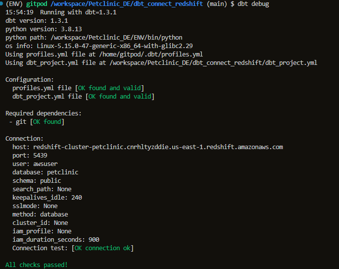

### build new model in dbt
go in by click into dbt_connect_redshift/model/ folder 
* create new sql file for new query or make staging table from existing table in cluster
  - try stg_pets.sql
    ```sh 
    select * from pets
    ```  

  - my_fisr_dbt_model.sql edit follow:  

  ```sh 
    {{ config(materialized='view') }}

      with source_data as (

          select ownerid as petownerid
          from owners

      )

    select *
    from source_data

    ```  

  - my_fisr_dbt_model.sql edit follow:  
  ```sh 
    select *
    from {{ ref('my_first_dbt_model') }}
    where petownerid = 2419
    ```  

* when new sql files are made run (dbt will build the new table table)
```sh
dbt run 
```
* go check (view) table or table depend on config dbt in the cluster query page in redshift cluster
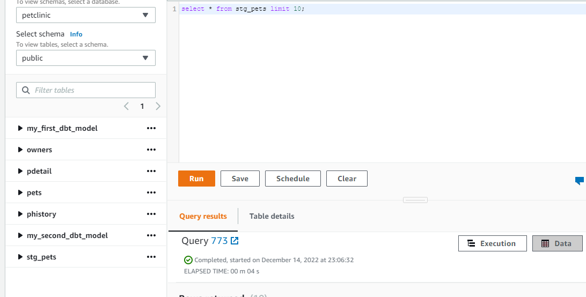
from pic here see stg_pets myfirstdbtmodel mysecondbtmodel are there  
query form stg_pets and run success too.  
ดูการ dbt run แก้ไขไม่ให้ error ด้วย

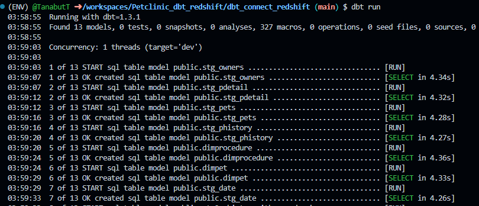
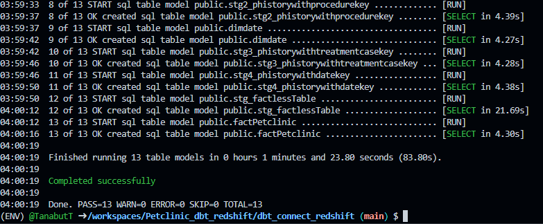  

* จาก data source ที่นำมาใช้  (ซึ่งตอนนี้อยู่ใน redshift แล้ว)
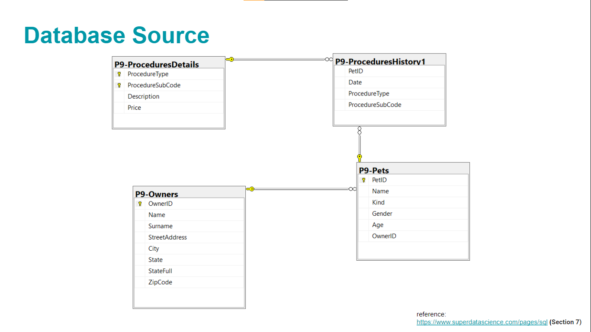
* ออกแบบให้เป็น star schema เผื่อใช้งาน เป็น datawarehouse 
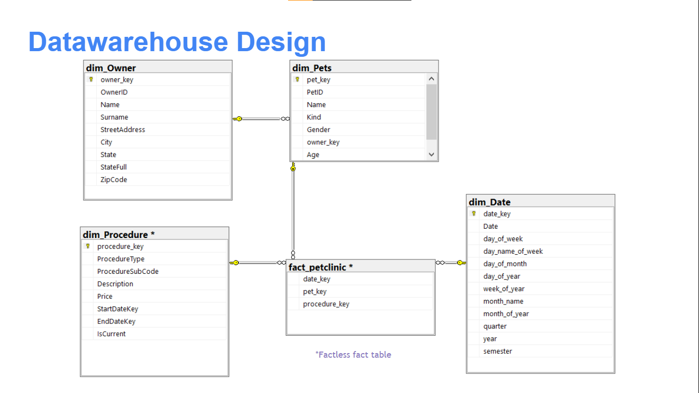  
มีการปรับเปลี่ยนไปบ้างในการ join กัน สุดท้ายไปดู docs ที่ได้จาก dbt docs serve 

### relationship from dbt
จาก folder ใน Petclinic_dbt_redshift/dbt_connect_redshift/models/petclinic_staging/ เก็บ model ที่ทำไว้เป็น datawarehouse
เมื่อลองทำ datawarehouse และ staging table ไว้ใช้งานแล้ว สามารถสร้าง docs ไว้ได้ 
สร้าง doc ใน dbt จากคำสั่ง 

```sh
dbt docs generate
```
และ run  

```sh
dbt docs serve 
```
!!! ลองรัน dbt docs serve --port 8089 แล้วเปลี่ยน ไม่ได้ควรใช้ default ถึงจะขึ้นที่ port 8080

ไปกดที่ขวาล่าง สามารถดู lineage graph ของ datawarehouse ของเราได้

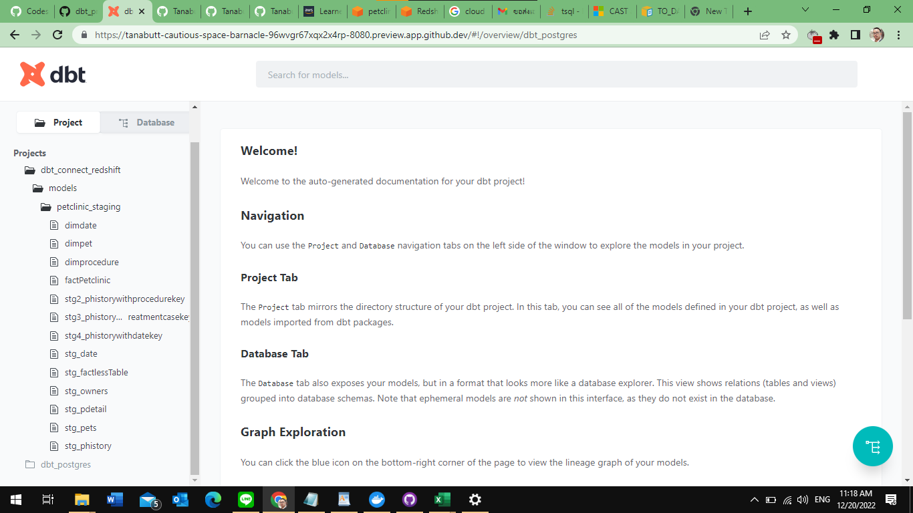

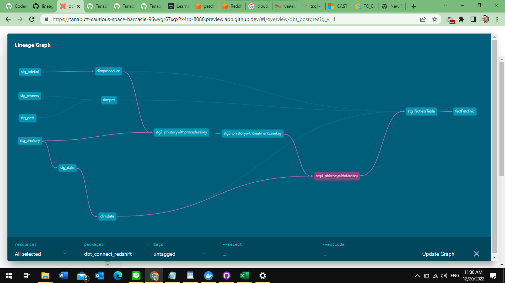


To close all service
- S3 empty bucket
- Delete S3 bucket
- Delete Redshift cluster** with out keeping snapshot** - [ ] snap shot 


## watch cost explorer


## Tableau-Redshift connection

connect easily with 
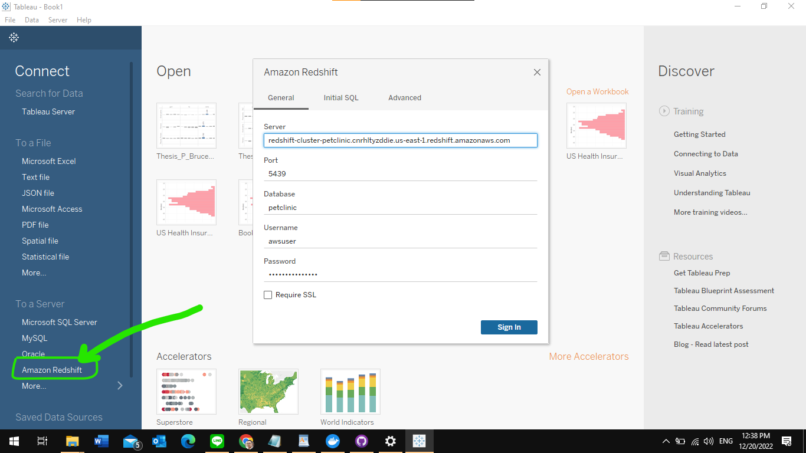  

- Server redshift-cluster-petclinic.cnrhltyzddie.us-east-1.redshift.amazonaws.com
- port 5439 
- database name petclinic
- username : "dbuser " 
- password : "yourpassword"
and then sign in 

### select table to work or join table from conncetion
- Choose schema here is  public   
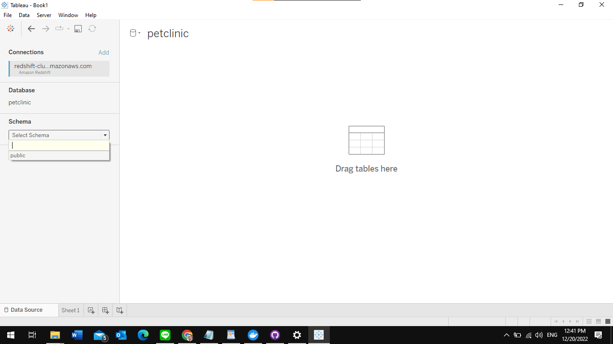  

- select table to work with  

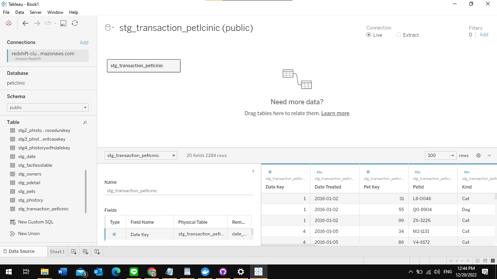  
or  

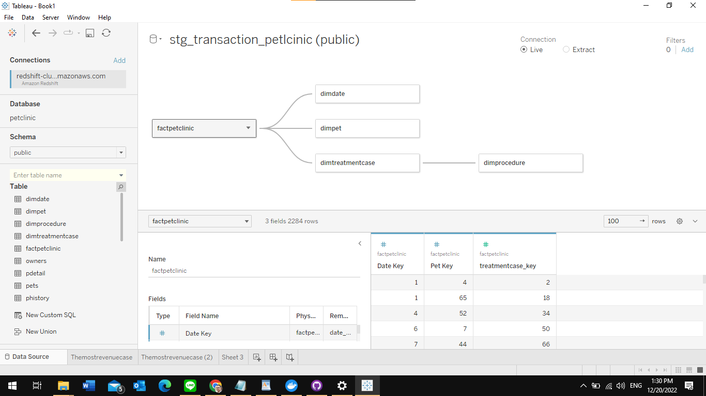  

- see at the top right corner that connection "live" with Redshift cluster database

### change some data type before go to build visualization
- Check data type properly
- change Date Treated to date format
- change price to number format
- update now (update live data) 

### Visualization to Awser the Question
#### from problem statement:
* Q1 : Petclinic in 2016, How seasanal revenue gain in each interval?

* Q2 : What procedure or treatment in each month cost the most to pet owner?  

* Q3 : Which king of pet cost the most to the owner? 

* Q4 : Can we estimate the inventory managment on overall and specific procedure seasonally next yaer?

#### Awser with your eyes
PetClinic Revenue 2016:  

https://public.tableau.com/app/profile/tanabut.taksinavongskul/viz/PetClinicRevenue2016/Revenues2016  

* A1 : look at the dash board here for monthly revenue and total in year 2016  
* A2 : dashboard show proceduretype that cost the most (give the most revenue to clinic = General Surgery)
  - Notice : Rabie Vaccination is the most freqeunt of procedure
* A3 : Pet owner can see the over the cost for kind of pet and gender of pet (total of all pet in year)  

* A4 : here dashboard to know usage on 2016  
Inventory Mornitor PetClinic:  

https://public.tableau.com/app/profile/tanabut.taksinavongskul/viz/InventoryMornitorPetClinic/InventoryManagement

-----------------THE END?---------------------
Note : Drill down more with the time serie data and dig some more insight.  


Happy Analyzing!
